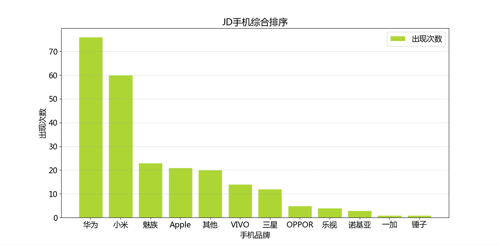
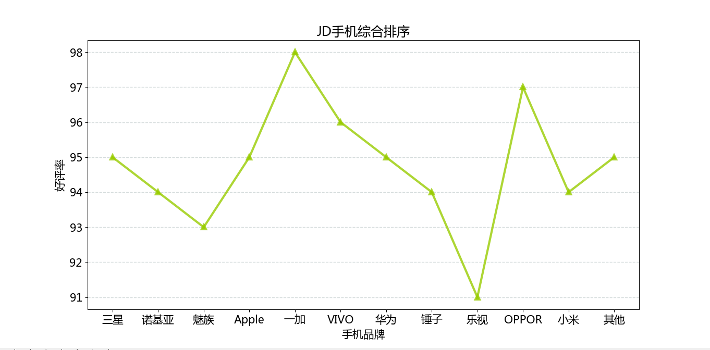

Welcome to My Scrapy Demo for JD-Phone
=============
Scrapy爬虫实例,结合[Scrapy官网][官网地址]文档,基于scrapy.Spider,对京东手机页面进行数据爬取.
自定义三个处理的Pipeline类(图像下载,Json转化,MySql数据存储).并对获取的数据,根据京东各品牌手机
好频率和热卖情况,结合pandas库,进行初步数据分析

[官网地址]: https://docs.scrapy.org/en/latest/intro/tutorial.html     "Scrapy官网"

#### 项目结构
-------------
- [image](#image)
- [JDPhone](#JDPhone)
    - [spiders](#spiders)
       - [jdphone-spider.py]   
    - [db.py](#db)
    - [imgPipelines.py](#imgPipelines)
    - [jsonPipelines.py](#jsonPipelines)
    - [mysqlPipelines.py](#mysqlPipelines)
    - [phoneItems.py](#phoneItems)
    - [settings.py](#settings)
- [data.json](#data)
- [scrapy.cfg](#scrapy)

## image

image文件夹用于存放爬取的京东手机图片


## JDPhone

JDPhone文件夹为该项目主体

## spiders

jdphone-spider.py文件是具体爬虫,对JD手机界面数据爬取,难点有两点：</br>
1.京东手机价格数据获取</br>
2.京东手机评价获取</br>

如果有web开发经验,可以通过F12查看京东相关Ajax接口,配合PostMan进行调试.

手机价格接口api(时间戳+pid):
````
https://p.3.cn/prices/mgets?pduid=' + ??? + '&skuIds=J_' + ???
````
手机评论接口api(pid):
````
https://club.jd.com/comment/productCommentSummaries.action?my=pinglun&referenceIds= + ???
````

相关数据分析,重写close(spider, reason)方法,也可在pipeline中操作


### 基于热卖情况（相关产品出现次数）   </br>



### 基于好评率（统计各个品牌平均好评率）  </br>



## db
MySql数据库连接类

## imgPipelines
imgPipelines.py文件用于处理下载京东手机图片

## jsonPipelines
jsonPipelines.py文件用于生成json文件,也可使用相关命令生成：
````
scrapy crawl jd-phone -o data.json
````

## mysqlPipelines
mysqlPipelines.py文件用于连接MySql数据库,存储京东手机信息

## phoneItems
phoneItems.py文件是自定义京东phone 实体类

## settings
settings.py文件用于设置该爬虫的一些基本配置,上面提到的三个自定义
pipelines需要在里面注册
````
ITEM_PIPELINES = {
   'JDPhone.jsonPipelines.JsonPipeline': 1,
   'JDPhone.imgPipelines.ImgPipeline': 5,
   'JDPhone.mysqlPipelines.mysqlPipeline': 9,
}
````

数据库相关信息
````
CONFIGS = {
    'db': {
        'host': '127.0.0.1',
        'port': 3306,
        'user': 'root',
        'password': '123456',
        'database': 'test'
    }
}
````

图片下载地址
````
IMAGES_STORE = 'E:\\PycharmWorkSpace\\Scrapy\\JDPhone\\image'
````


## data.json
略

## scrapy
略


